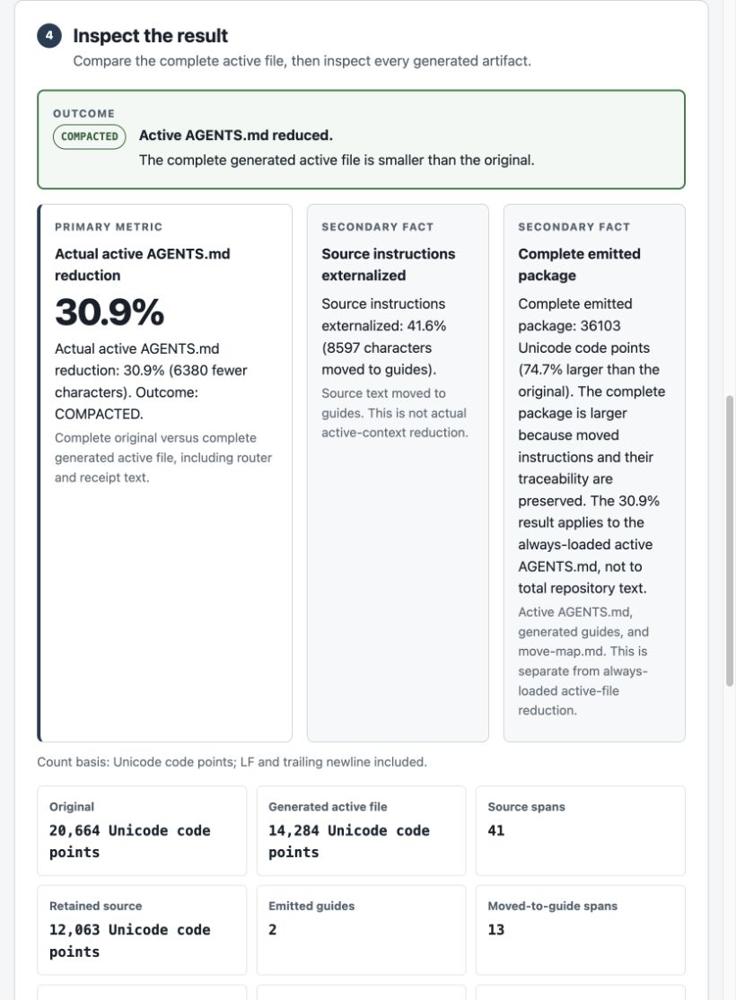
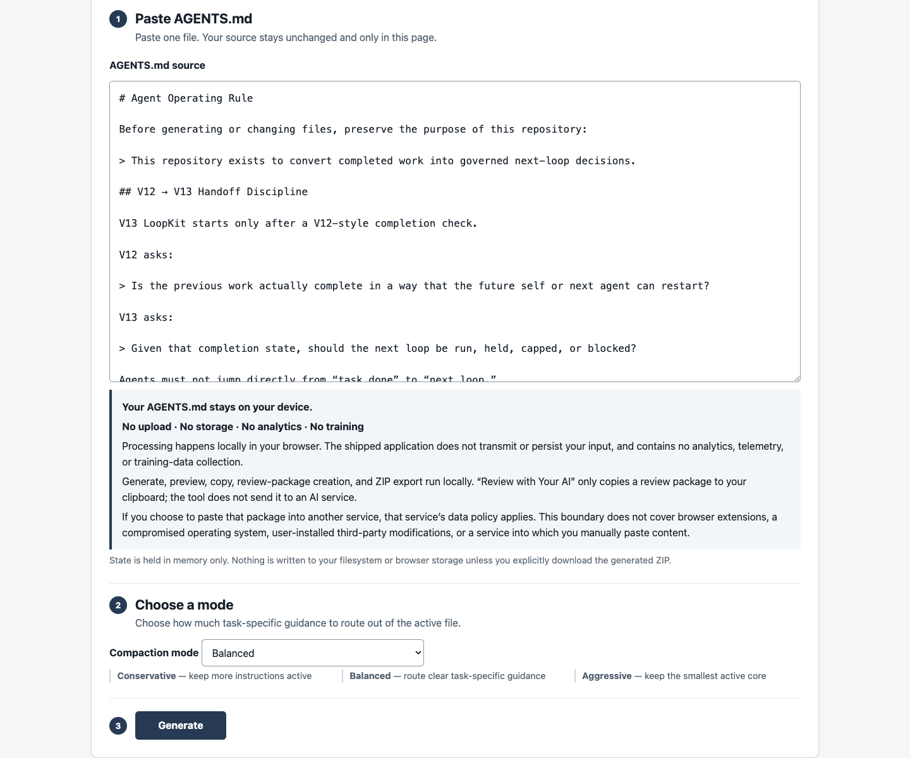
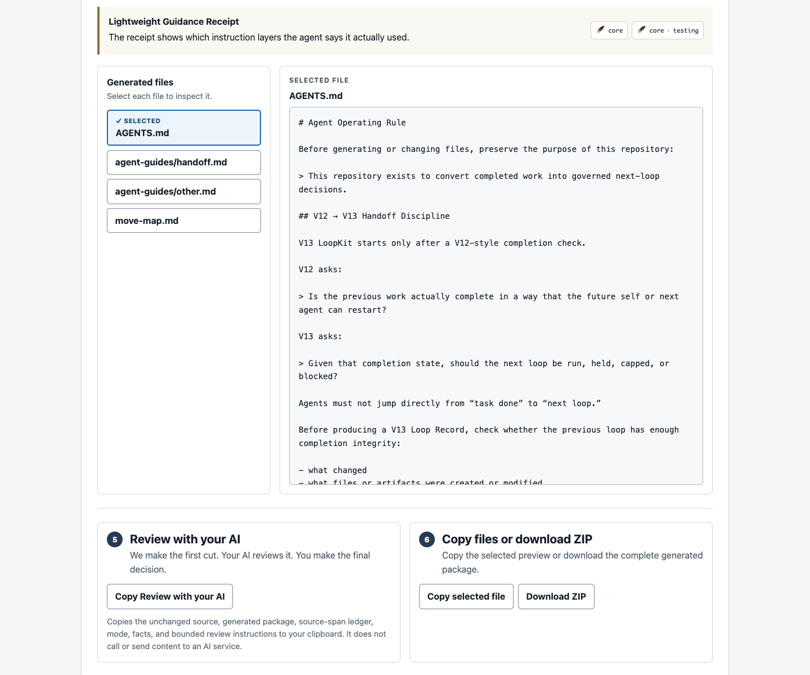

# AGENTS.md Compactor

## Your AGENTS.md does not have to be all-or-nothing.

When an `AGENTS.md` grows over a long-lived repository, the usual choices are
uncomfortable: keep every accumulated rule always loaded, or delete
operational knowledge that may still matter later.

AGENTS.md Compactor offers a third structure. It keeps universally needed
rules active, moves conditional detail into reconnectable guides, leaves
clear triggers in the active file, and keeps moved source instructions
traceable.

> **Demonstrated historical result**
>
> `20,664 → 14,284 Unicode code points`
>
> **30.9% less active AGENTS.md text**
>
> **0 unique instructions deleted** · **13/13 moved instruction bodies
> preserved byte-for-byte**

Conditional instructions move out of the always-loaded file without being
deleted; reconnect triggers remain active.

**What the 30.9% measures:** the active `AGENTS.md`, not the total emitted
package.

The full package is **32,383 Unicode code points (+56.7% versus the original)**
because it preserves the moved instructions and their traceability.

## Demonstrated historical result

This is a fixed, governance-heavy historical corpus—not a universal benchmark.

| Active-file result | Historical value |
| --- | ---: |
| Original active file | 20,664 Unicode code points |
| Generated active file | 14,284 Unicode code points |
| Active-file reduction | 6,380 / 30.9% |
| Source accounting | 41 total / 28 retained / 13 moved |
| Folded / deleted / unaccounted | 0 / 0 / 0 |
| Reconnect routes | 10 |

All 13 moved source bodies are preserved byte-for-byte. The count basis is
Unicode code points with LF line endings and any trailing newline included.

The package-total disclosure is part of the result, not a hidden qualifier:
the active `AGENTS.md`, two guides, and move map total **32,383 Unicode code
points**. That is **+56.7% versus the original** because the package retains
the moved knowledge and the traceability needed to reconnect to it.

<p align="center">
  <a href="evidence/public_rc_v0_1/EVIDENCE.md">
    
  </a>
</p>

*The active file is smaller; the complete routed package is larger because it preserves reconnectable knowledge and traceability.*

*Evidence boundary: Shows the fixed historical result for this corpus and mode. It is not a token, cost, latency, model-quality, or general-performance claim. [Evidence and reproducibility](evidence/public_rc_v0_1/EVIDENCE.md)*

## How the third option works

```text
Active AGENTS.md
├─ authority
├─ safety
├─ Gate / CAP / BLOCK
├─ Decision Owner
└─ reconnect triggers

Generated guides
├─ handoff procedures
├─ conditional formats
├─ examples
└─ task-specific detail
```

Universal instructions stay in the active file. Conditional material may move
to a guide, including conditional obligations and prohibitions—not only
examples or templates. The active file retains a trigger that identifies when
to reconnect to that material. The move map records the canonical destination
for each classified source span.

The original pasted source remains separate from the generated artifacts. A
result is `COMPACTED` only when the complete generated active file, including
routes and its Lightweight Guidance Receipt, is smaller than the original.
Otherwise the outcome is `NO_ACTIVE_REDUCTION`; the tool does not present
externalized text as active-file reduction.

## v0.1 Promise

Paste one long `AGENTS.md`, select a mode, and inspect a generated package
before choosing whether to use it.

1. Paste `AGENTS.md`
2. Compact
3. Inspect the active file, guides, and move map
4. Download ZIP or copy the review package for independent AI review

<p align="center">
  <a href="evidence/public_rc_v0_1/EVIDENCE.md">
    
  </a>
</p>

*Paste one AGENTS.md, choose a compaction mode, and keep the source in the browser.*

*Evidence boundary: Demonstrates the input and selection surface only. It does not prove a result, privacy beyond the stated application boundary, or performance on the visible source. [Evidence and reproducibility](evidence/public_rc_v0_1/EVIDENCE.md)*

“Review with your AI” only copies the package to your clipboard. It does not
send input to an AI service; you choose whether and where to paste it.

## What the output contains

- a generated active `AGENTS.md` with universal rules and reconnect triggers;
- non-empty Markdown guides for conditional material;
- `move-map.md`, which shows what moved and why;
- actual active-file reduction and separate source-externalization facts;
- a Lightweight Guidance Receipt contract in the active file;
- explicit copy, clipboard-review, and ZIP export actions.

<p align="center">
  <a href="evidence/public_rc_v0_1/EVIDENCE.md">
    
  </a>
</p>

*Inspect the active file, every routed guide, and the move map before copying a review package or downloading the ZIP.*

*Evidence boundary: Demonstrates available local actions. “Review with your AI” copies to clipboard only; it does not call an external AI service or establish external review. [Evidence and reproducibility](evidence/public_rc_v0_1/EVIDENCE.md)*

## Lightweight Guidance Receipt

The generated file instructs the agent to end each response with one of these
markers:

- `🪶 Core only`
- `🪶 Core + testing`
- `🪶 Core + release · security`

`Core only` is valid and useful when no conditional guide was read. Listed
guides are guides the agent says it actually read. The marker is a declaration,
not proof of guide reading or runtime compliance. The feather represents only a
lighter always-loaded instruction surface; it does not establish token, cost,
time, or model-performance savings.

## Why this differs from semantic AI rewriting

The historical human+AI result was:

`20,664 → 11,141 / 46.1%`

It is a **semantic rewrite baseline — not a lossless compression target**.
It can become smaller and improve human readability, but it may add new
meaning, change authority or modality, omit required fields, and needs
complete human review.

| Semantic rewrite | AGENTS.md Compactor |
| --- | --- |
| Can become smaller | Accepts a smaller reduction in exchange for traceability |
| Can improve human readability | Deterministic |
| May add new meaning or change authority/modal language | Source-accounted |
| May omit required fields | Moved source bodies preserved byte-for-byte |
| Requires complete human review | One canonical home and reconnectable routes |

The 46.1% result is neither a product failure nor a directly equivalent
benchmark. It answers a different question: semantic editing with human
judgment, rather than a deterministic, source-accounted routing package.

## Evidence and reproducibility

The self-contained historical evidence is in
[`evidence/public_rc_v0_1/EVIDENCE.md`](evidence/public_rc_v0_1/EVIDENCE.md).
It includes the exact source, expected generated artifacts, hashes, accounting,
routes, limitations, and an offline reproduction script.

From a fresh clone, with Node.js available:

```sh
node evidence/public_rc_v0_1/reproduce.mjs
```

The reproduction uses tracked files only and does not require the original V13
repository. Run the full automated suite with:

```sh
npm test
```

The current candidate's full automated suite passes 108 tests, including a
focused historical regression test that fixes the 20,664 → 14,284 result,
source accounting, artifact hashes, and reconnect targets.

### Three modes, one historical frontier

On this governance-heavy corpus, Conservative, Balanced, and Aggressive all
reached the same safe deterministic frontier: **14,284 code points / 30.9%
active-file reduction**. Other fixtures can produce different mode results.
Aggressive is not promised to be smaller.

## Privacy boundary

**Your AGENTS.md stays on your device.**

**No upload · No storage · No analytics · No training**

Processing happens locally in your browser. The shipped application does not
transmit your input or persist your input. It contains no analytics, telemetry,
or training-data collection. Generation, preview, copy, review-package
creation, and ZIP export run locally.

Review with your AI only copies a review package to your clipboard. It does
not call an AI service. If you manually paste the package into another service,
that service’s data policy applies.

More precisely: there is no application persistence, analytics, telemetry,
training collection, or external asset dependency. This boundary does not
cover browser extensions, operating-system compromise, modified copies of the
application, or a third-party service after you manually paste content there.

## Is this a fit for your repository?

AGENTS.md Compactor is most useful when an `AGENTS.md` is large, the repository
is long-lived, conditional procedures and templates have accumulated,
traceability matters, and agents repeatedly load the active file.

You should usually keep the current file when it is small, nearly all
instructions are universal, or generated routing would make the active file
larger. `NO_ACTIVE_REDUCTION` is a valid outcome, not an error or a disguised
saving.

## Limitations

- The demonstrated 30.9% result is one historical corpus, not universal
  performance.
- Unicode code points are not tokens, cost, latency, or a model-quality
  measurement.
- The complete emitted package can be larger than the original.
- Routes and the Guidance Receipt do not guarantee that an agent will follow
  the guidance.
- The tool neither establishes semantic equivalence nor safety certification.
- v0.1 accepts one pasted `AGENTS.md`; it does not scan repositories, resolve
  nested instruction files, or replace source files automatically.

## Repository working records

Root `AGENTS.md`, `handoff/`, and development-governance records are this
project's own dogfood/internal operating artifacts: published working examples,
not end-user instructions. Terms such as Fable, Codex, Capsule, and internal
Gates refer to this project's development workflow.

## Development story

AGENTS.md Compactor was directed by Shin, working with AI agents without a
conventional software-engineering background. The notable contribution was
Decision ownership, not a claim about coding novelty: rejecting
source-externalization percentage as active reduction; detecting universal
safety rules routed under narrow triggers; refusing to stop at a weak 16%
result; reaching 30.9% without altering preserved source bodies; refusing to
call failed evidence delivery a successful audit; and constructing reproducible
evidence before public review.

Those are bounded product decisions recorded in the repository’s validation
and evidence materials. They do not establish general reliability, adoption,
or release readiness.

## Local installation and commands

This repository has no runtime dependency installation step. With a current
Node.js runtime:

```sh
npm test
npm run ui
```

Then open `http://127.0.0.1:4173`, paste one `AGENTS.md`, select Conservative,
Balanced, or Aggressive, and choose **Generate**. The source and generated
artifacts are held in memory unless you explicitly copy text or download the
ZIP.

## License

Licensed under the [Apache License 2.0](LICENSE).
